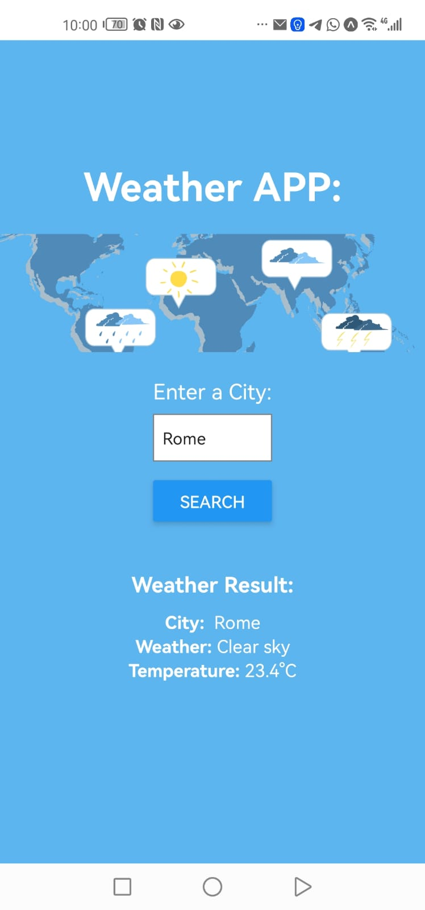
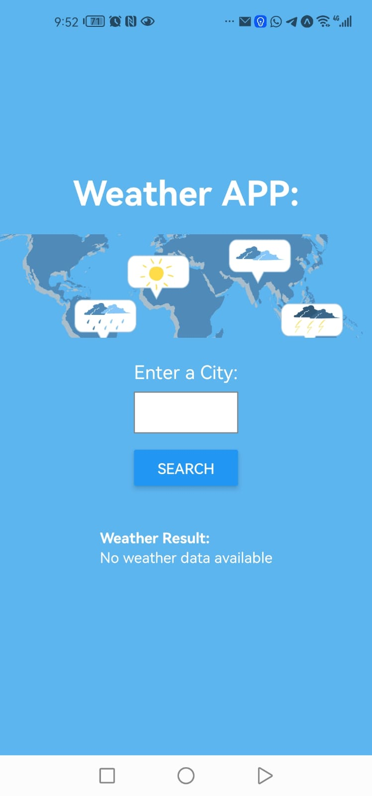
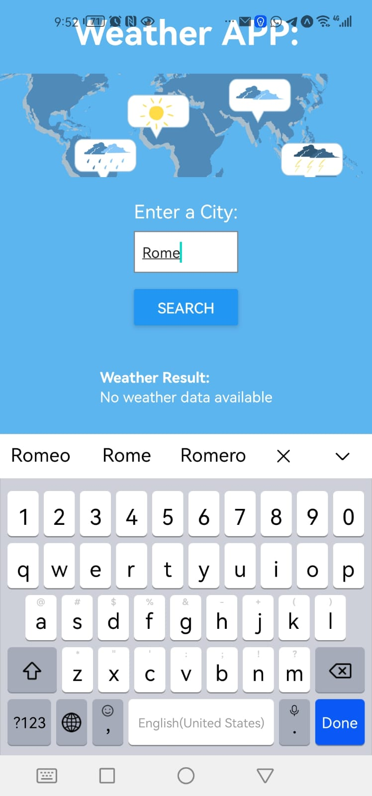

# Lab 42
Authors: Sham Al-Jalam

#### a weather app using React Native:
I have built a weather app using React Native and expo that can get weather data about a certain city. i have used weatherbit API, and after you type the city and submit, the city name, weather desc and weather temp will be shown.

to check on my progress through the devlopment of the app i used expo go on my phone and connected to it through a QR code

### Running the app:
* npx expo start --tunnel

##### Note: if the API call didn't work, try changing the API key to this one: `0fdb048a0bd6490baf9e83648d330124`

### demo

